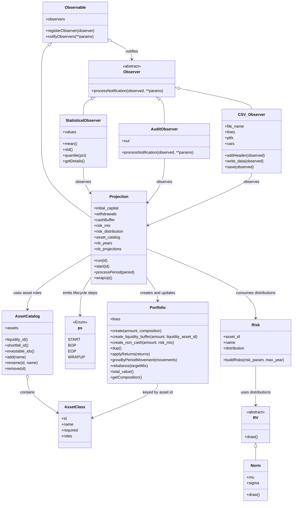

# finproj

## Stochastic financial projections to optimize asset management

- A simple Monte Carlo simulation tool that projects future investment portfolio performance under various assumptions: portfolio composition, asset returns, and withdrawal needs.
- It helps users evaluate different asset allocation strategies, and safety cash levels, under various market scenarios to make better-informed asset allocation and fund withdrawal decisions.
- It runs locally on your machine and is accessible via a user friendly browswe interface, guaranteeing the privacy and confidentiality of the data used in your simulations.

## Features

- Stochastic modeling using Monte Carlo simulation
- Local web GUI for editing assumptions, running simulations, and viewing summary chartsFlexible input assumptions (expected returns, volatility, inflation, contributions/withdrawals, etc.)
- **Customizable asset classes** — rename, add, or remove optional investable assets; four core classes are always present (Cash, Money Market, Bonds, Stocks)
- Generates thousands of possible future scenarios
- Companion Excel visualizer (`output/finproj.xlsx`) for easy analysis and charting
- Simulations run privately on a local machine. No interaction with AI or other third party service. Important for a financial security standpoint!
- Correlated asset-class returns via a Cholesky decomposition of a user-defined correlation matrix

## Quick Start

### 1. Prerequisites

- Python 3.8+ for the command-line simulation
- Python 3.10+ for the optional GUI (`requirements-gui.txt`)

### 2. Run with the GUI (optional)

Install GUI dependencies once:

```bash
pip install -r requirements-gui.txt
```

Then launch the local app from the project root:

- **Mac / Linux:** `./run_gui.sh`
- **Windows:** double-click `run_gui.bat`, or run it from Command Prompt

Alternatively:

```bash
streamlit run gui/app.py
```

The GUI runs on `localhost` only. Use it to:

1. Edit portfolio assumptions (capital, withdrawals, cash buffer, horizon, projection count)
2. **Customize the asset list** — rename any class; add optional classes (e.g. Commodities); delete optional classes; reset to defaults
3. Set allocation weights, return assumptions (mu/sigma), and pairwise correlations
4. Run the simulation with a progress bar, view NAV summary statistics and charts, and download `output.csv`

For deeper analysis (fan charts, scenario navigator), refresh `output/finproj.xlsx` in Excel as described below.

### 3. Run the Monte Carlo Simulation (command line)

The simplest way to start the simulation is to use the launcher scripts from the project root:

- **Mac / Linux:** `./run_simulation.sh`
- **Windows:** double-click `run_simulation.bat`, or run it from Command Prompt

These scripts activate the local `.venv` if present, then run the simulation for you.

Alternatively, you can invoke Python directly:

Either approach will generate or update `output/output.csv` with the simulation results.

### 4. Visualize Results in Excel

- Open `output/finproj.xlsx`
- Make sure the Excel file is properly connected to the `output/output.csv` file generated by the Python code:
  - in Excel, go to Data -> Get Data (Power Query) -> Launch Power Query Editor
  - locate the 'output' query and click on 'Advanced Editor'
  - in line 2, change the path to where `output/output.csv` is located on your drive
- Go to the Data tab → click Refresh All
- After running a new simulation with Python, simply refresh the Excel file to see the latest Monte Carlo results seamlessly.

### 5. Change the Financial Assumptions

**GUI (recommended):** use section **2. Investable asset classes** in the GUI to rename, add, or remove optional assets, then adjust allocation, returns, and correlations in the sections below it.

**Command line / code:** defaults live in [code/inv_proj_runner.py](code/inv_proj_runner.py). [code/inv_proj_run.py](code/inv_proj_run.py) is a thin entry point that runs those defaults.

- Edit `SimulationConfig` defaults (or the `DEFAULT_*` constants) for capital, withdrawals, cash buffer, horizon, and projection count.
- Edit `default_asset_classes()` in [code/asset_classes.py](code/asset_classes.py) to change the built-in asset list programmatically.
- Edit `DEFAULT_RISK_MIX_PRESETS` for the `safe`, `moderate`, and `performance` allocation presets.
- Edit `DEFAULT_RISK_PARAM` for expected return (`mu`) and volatility (`sigma`) per asset id.
- Edit `DEFAULT_RISK_CORRELATION` for pairwise correlations between asset ids.

#### Asset classes

Every simulation uses an **asset catalog**. Four assets are always required and cannot be removed:


| Asset id       | Default name | Role                                                                                               |
| -------------- | ------------ | -------------------------------------------------------------------------------------------------- |
| `cash`         | Cash         | Liquidity buffer — holds the cash reserve; withdrawals are taken from here first                   |
| `money_market` | Money Market | Investable low-risk asset                                                                          |
| `bonds`        | Bonds        | Investable asset; also covers withdrawal shortfalls and funds cash-buffer replenishment from gains |
| `stocks`       | Stocks       | Investable equity asset                                                                            |


Optional defaults (Crypto, Precious Metals, Real Estate) can be renamed, removed, or supplemented with new investable classes. Display names are user-editable; stable **asset ids** (e.g. `bonds`, `real_estate`) are used internally in CSV output and configuration dictionaries.

The amount parser accepts shorthand values such as `40k`, `1M`, and `2.5B`, so you can modify capital and withdrawal assumptions without converting everything to raw numbers first.

## Project Structure

- `code/inv_proj.py` — Core simulation logic and classes
- `code/asset_classes.py` — Asset catalog: required/optional classes, roles, add/rename/remove
- `code/inv_proj_runner.py` — Shared simulation configuration and runner (used by CLI and GUI)
- `code/inv_proj_run.py` — Command-line entry point
- `gui/app.py` — Streamlit GUI for asset list, assumptions, runs, and summary charts
- `gui/theme.py` — Browser styling tokens (fonts, colors, spacing, borders); edit `THEME` to customize
- `.streamlit/config.toml` — Base Streamlit theme (primary color, backgrounds)
- `requirements-gui.txt` — Optional GUI dependencies (Streamlit, matplotlib)
- `output/finproj.xlsx` — Companion Excel workbook for visualization and analysis
- `output/output.csv` — Generated simulation results (created at runtime, not committed to Git)
- `tests/test_correlated_returns.py` — Statistical tests for correlated return sampling
- `tests/test_asset_classes.py` — Tests for the asset catalog

## How It Works

`finproj` is a stochastic financial projection tool that uses **Monte Carlo simulation** to model how an investment portfolio might evolve over time under uncertain market conditions. Instead of giving a single "expected" outcome, it runs thousands of possible future scenarios to show a realistic range of results — helping users understand risks and make more informed asset allocation decisions.

The core engine lives in `code/inv_proj.py`. Investable assets are defined by an **asset catalog** (`code/asset_classes.py`) rather than a fixed hard-coded list. Each asset has a stable id, a display name, and one or more **roles** (liquidity buffer, investable, shortfall source, replenishment source). The engine models annual returns using normal distributions with user-defined expected returns (mu) and volatility (sigma). A `Portfolio` class manages allocation across investable assets, handles rebalancing, cash withdrawals, and the cash buffer.

Each Monte Carlo run (`Projection` class) starts with an initial capital, splits it between a **Cash** liquidity reserve and the invested portfolio, then simulates year by year. In every period the model:

- Withdraws the planned spending (first from Cash, then from Bonds if needed),
- Rebalances the portfolio to the target mix,
- Draws correlated random returns for each asset class,
- Applies those returns and optionally replenishes the cash buffer from gains (typically from Bonds).

`code/inv_proj_runner.py` holds the default configuration; `code/inv_proj_run.py` runs it from the command line. Defaults use **2,000 projections** over **15 years** with a diversified "performance" mix (e.g., 40% Stocks, 30% Bonds, 20% Real Estate, plus smaller allocations to Crypto and Precious Metals). Several **observers** track results: one collects statistics on Net Asset Value at key years, while `CSV_Observer` writes detailed data from every simulation path into `output/output.csv`. Asset display names appear in the CSV; ids are used internally.

The generated `output/output.csv` serves as the bridge to the companion Excel file (`output/finproj.xlsx`). After running the Python simulation, users simply refresh the spreadsheet to see updated charts, summary statistics, and visualizations of the thousands of possible portfolio outcomes.

This approach gives a transparent, probabilistic view of long-term portfolio behavior rather than a single deterministic forecast.

## Analysis of the output

### 1. Structure of the output file

The output file contains all the values observed during the computation across all simulations, all periods, and all asset classes.
The following screenshot shows the structure of the `output/output.csv` generated by the Python program:


++simulation++: the id of the run to which the data belongs

++period++: the period in which the data is calculated

++variable++: the observed quantity during the period: for example: 

- ptf_bop = net asset value of the portfolio at the beginning of the period
- ptf_eop = net asset value of the portfolio at the end of the period
- withdrawals = amount of assets cashed and withdrawn from the portfolio during the period

++risk++: the asset class (display name) to which the amount value corresponds

++value++: the amount of that variable

### 2. Companion visualization spreadsheet

The `output/finproj.xlsx` companion file contains the following visualizations, helpful for humans:

#### Moments of the simulations


#### evolution of the Net Asset Value (nav)


#### Scenario navigator


## For Those Who Want to Look Under the Hood

### introduction

The simulation is built around a clean **Observer pattern**, which keeps the core engine decoupled from how results are collected and stored.

At the heart of the system is the `Projection` class. As it runs each Monte Carlo path year by year, it notifies a list of registered **observers** after every period. This design makes it easy to add new types of analysis without modifying the simulation logic itself.

Currently, two main observers are implemented:

- `**StatisticsObserver`**: Tracks key metrics such as Net Asset Value (NAV) at specific years (e.g., year 5, 10, and 15). It calculates summary statistics (mean, median, percentiles, success rates, etc.) across all simulation paths.
- `**CSV_Observer**`: Writes the full raw data from every simulation path into `output/output.csv`. This detailed output powers the companion Excel visualizer, allowing users to create custom charts, histograms, and sensitivity tables.

This observer-based architecture makes the code highly extensible. If you want to add new metrics (such as maximum drawdown, probability of ruin, or inflation-adjusted spending), you can simply create a new observer class that implements the required interface and register it in `code/inv_proj_runner.py` — without touching the core simulation engine.

The entire model is intentionally transparent and modular, so advanced users can inspect, modify, or extend any part of the stochastic projection process.

### Main class diagram




## License

This project is licensed under the GNU Affero General Public License v3.0 (AGPLv3) for open-source and non-commercial use.
For commercial use, closed-source integration, SaaS deployment, or enterprise licensing, please contact me.

## Editing credits

Grok assisted Alex Scherer in editing this readme file, most significantly by proposing verbiage for the sections analyzing how the code works and proposing grammar and stylistic corrections. 

## Disclaimer

This tool is presented "as is", for educational and informational purposes only. It is not financial advice. Always consult a qualified financial advisor for actual investment decisions.