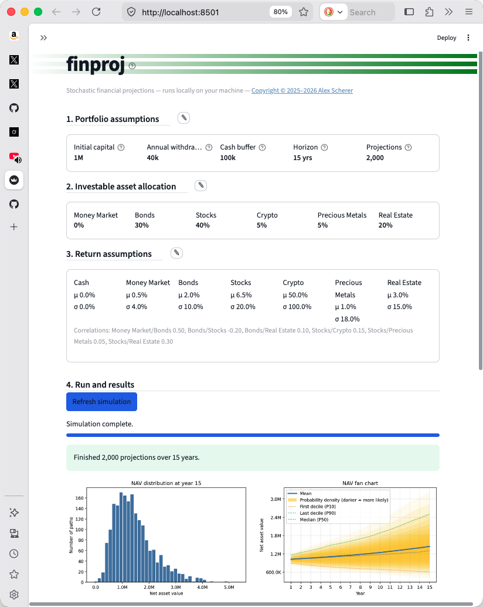
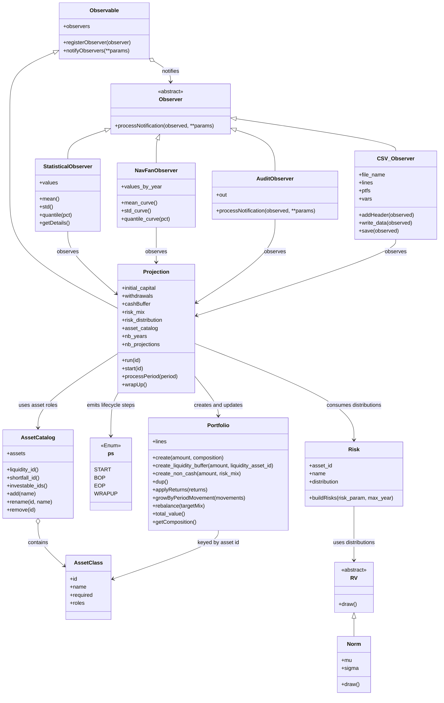

# finproj

## Stochastic financial projections to optimize asset management

- A simple Monte Carlo simulation tool that projects future investment portfolio performance under various assumptions: portfolio composition, asset returns, and withdrawal needs.
- It helps users evaluate different asset allocation strategies, and safety cash levels, under various market scenarios to make better-informed asset allocation and fund withdrawal decisions.
- It runs locally on your machine and is accessible via a user-friendly browser interface, guaranteeing the privacy and confidentiality of the data used in your simulations.

<div align="center">


</div>


## Features

- Stochastic modeling using Monte Carlo simulation
- **Local web GUI** for editing assumptions, running simulations, and viewing live-updating charts and summary statistics (the program can also run from the command line and be used as a library in other application, subject to licensing)
- Flexible input assumptions: expected returns, volatility, initial capital, annual withdrawals, cash buffer, horizon, and projection count
- **Customizable asset classes** — rename, add, or remove optional investable assets; four core classes are always present (Cash, Money Market, Bonds, Stocks)
- **Save and load scenarios** as JSON files from the GUI sidebar
- Correlated asset-class returns via Cholesky decomposition of a user-defined correlation matrix
- Generates thousands of possible future scenarios (default: 2,000 paths over 15 years)
- **Interactive results**: NAV fan chart (median with nested probability-density bands), horizon-year NAV distribution histogram, and key outcome probabilities
- Companion Excel workbook (`output/finproj.xlsx`) for deeper analysis (scenario navigator, additional charts)
- Runs entirely on your local machine — no cloud services or third-party APIs; suitable for sensitive financial data

## Quick Start

### 1. Prerequisites

- Python 3.8+ for the command-line simulation
- Python 3.10+ for the optional GUI (`requirements-gui.txt`)

### 2. Run the Monte Carlo Simulation (command line - no graphic user interface)

The simplest way to start the simulation is to use the launcher scripts from the project root:

- **Mac / Linux:** `./run_simulation.sh`
- **Windows:** double-click `run_simulation.bat`, or run it from Command Prompt

These scripts activate the local `.venv` if present, then run the simulation for you.

Alternatively, from the project root:

```bash
python code/inv_proj_run.py
```

Either approach will generate or update `output/output.csv` with the simulation results.

### 3. Run within the graphic user interface

Install GUI dependencies once (the launcher scripts can also install them automatically if missing):

```bash
pip install -r requirements-gui.txt
```

Then launch the local app from the project root:

- **Mac / Linux:** `./run_gui.sh`
- **Windows:** double-click `run_gui.bat`, or run it from Command Prompt

Alternatively:

```bash
python -m streamlit run gui/app.py
```

The GUI runs on `localhost` only. The main workflow has four sections:

1. **Portfolio assumptions** — initial capital, annual withdrawals, cash buffer, horizon, and number of Monte Carlo paths (with shorthand amounts such as `1M` or `40k`)
2. **Investable asset allocation** — customize the asset list (rename, add optional classes, remove optional classes), set weights, and load preset mixes
3. **Return assumptions** — expected return (μ) and volatility (σ) per asset, plus pairwise correlations
4. **Run and results** — run or refresh the simulation; charts update live during the run, then show:
   - NAV fan chart (P10 / median / P90 with nested probability-density bands)
   - NAV distribution at the horizon year
   - Probability of negative final NAV and probability of exceeding initial capital
   - Summary statistics table (mean, std dev, percentiles, min/max at years 1, 5, 10, and horizon)
   - Download link for `output.csv`

Use the sidebar to name, save, load, or export assumption sets as JSON, and to set the output directory.

For additional charts and the scenario navigator, refresh `output/finproj.xlsx` in Excel as described below.

### 4. Visualize Results in Excel

- Open `output/finproj.xlsx`
- Make sure the Excel file is properly connected to the `output/output.csv` file generated by the Python code:
  - in Excel, go to Data -> Get Data (Power Query) -> Launch Power Query Editor
  - locate the 'output' query and click on 'Advanced Editor'
  - in line 2, change the path to where `output/output.csv` is located on your drive
- Go to the Data tab → click Refresh All
- After running a new simulation with Python, simply refresh the Excel file to see the latest Monte Carlo results seamlessly.

### 5. Change the Financial Assumptions

**GUI (recommended):** use the various sections in the GUI to change capital amount, liquidiy requirement, number of runs (section 1), rename, add, or remove optional assets, and adjust allocation (section 2), and change returns, and correlations (section 3). Assumptions can be saved and reloaded from the sidebar.

**Command line / code:** defaults live in [code/inv_proj_runner.py](code/inv_proj_runner.py). [code/inv_proj_run.py](code/inv_proj_run.py) is a thin entry point that runs those defaults.

- Edit `SimulationConfig` defaults (or the `DEFAULT_*` constants) for capital, withdrawals, cash buffer, horizon, and projection count.
- Edit `default_asset_classes()` in [code/asset_classes.py](code/asset_classes.py) to change the built-in asset list programmatically.
- Edit `DEFAULT_RISK_MIX_PRESETS` for the `safe`, `moderate`, and `performance` allocation presets.
- Edit `DEFAULT_RISK_PARAM` for expected return (`mu`) and volatility (`sigma`) per asset id.
- Edit `DEFAULT_RISK_CORRELATION` for pairwise correlations between asset ids.

#### Asset classes

Every simulation uses an **asset catalog**. Four assets are always required and cannot be removed:


| Asset id       | Default name | Role                                                                                               |
| -------------- | ------------ | -------------------------------------------------------------------------------------------------- |
| `cash`         | Cash         | Liquidity buffer — holds the cash reserve; withdrawals are taken from here first                   |
| `money_market` | Money Market | Investable low-risk asset                                                                          |
| `bonds`        | Bonds        | Investable asset; also covers withdrawal shortfalls and funds cash-buffer replenishment from gains |
| `stocks`       | Stocks       | Investable equity asset                                                                            |


Optional defaults (Crypto, Precious Metals, Real Estate) can be renamed, removed, or supplemented with new investable classes. In the GUI, section 2 sets weights for **investable** assets only; Cash is configured separately as the liquidity buffer in section 1. Display names are user-editable; stable **asset ids** (e.g. `bonds`, `real_estate`) are used internally in CSV output and configuration dictionaries.

The amount parser accepts shorthand values such as `40k`, `1M`, and `2.5B`, so you can modify capital and withdrawal assumptions without converting everything to raw numbers first.

## Project Structure

- `code/inv_proj.py` — Core simulation logic and classes
- `code/asset_classes.py` — Asset catalog: required/optional classes, roles, add/rename/remove
- `code/assumptions.py` — Save/load scenario assumptions as JSON (used by the GUI)
- `code/inv_proj_runner.py` — Shared simulation configuration and runner (used by CLI and GUI)
- `code/inv_proj_run.py` — Command-line entry point
- `gui/app.py` — Streamlit GUI for assumptions, runs, charts, and summary statistics
- `gui/charts.py` — Matplotlib chart builders (NAV fan chart, distribution histogram)
- `gui/formatting.py` — Compact number formatting and summary table HTML
- `gui/theme.py` — Browser styling tokens (fonts, colors, spacing, borders); edit `THEME` to customize
- `.streamlit/config.toml` — Base Streamlit theme (primary color, backgrounds)
- `requirements-gui.txt` — Optional GUI dependencies (Streamlit, matplotlib)
- `assumptions/` — Default location for saved scenario JSON files
- `screenshots/` — README illustration and example Excel output screenshots
- `output/finproj.xlsx` — Companion Excel workbook for visualization and analysis
- `output/output.csv` — Generated simulation results (created at runtime, not committed to Git)
- `output/audit.txt` — Simulation audit log (created at runtime)
- `tests/test_correlated_returns.py` — Statistical tests for correlated return sampling
- `tests/test_asset_classes.py` — Tests for the asset catalog
- `tests/test_assumptions.py` — Tests for assumptions save/load and config round-trip

## How It Works

`finproj` is a stochastic financial projection tool that uses **Monte Carlo simulation** to model how an investment portfolio might evolve over time under uncertain market conditions. Instead of giving a single "expected" outcome, it runs thousands of possible future scenarios to show a realistic range of results — helping users understand risks and make more informed asset allocation decisions.

The core engine lives in `code/inv_proj.py`. Investable assets are defined by an **asset catalog** (`code/asset_classes.py`) rather than a fixed hard-coded list. Each asset has a stable id, a display name, and one or more **roles** (liquidity buffer, investable, shortfall source, replenishment source). The engine models annual returns using normal distributions with user-defined expected returns (mu) and volatility (sigma). A `Portfolio` class manages allocation across investable assets, handles rebalancing, cash withdrawals, and the cash buffer.

Each Monte Carlo run (`Projection` class) starts with an initial capital, splits it between a **Cash** liquidity reserve and the invested portfolio, then simulates year by year. In every period the model:

- Withdraws the planned spending (first from Cash, then from Bonds if needed),
- Rebalances the portfolio to the target mix,
- Draws correlated random returns for each asset class,
- Applies those returns and optionally replenishes the cash buffer from gains (typically from Bonds).

`code/inv_proj_runner.py` holds the default configuration; `code/inv_proj_run.py` runs it from the command line. Defaults use **2,000 projections** over **15 years** with a diversified "performance" mix (e.g., 40% Stocks, 30% Bonds, 20% Real Estate, plus smaller allocations to Crypto and Precious Metals). Several **observers** track results: `StatisticalObserver` instances collect NAV statistics at years 1, 5, 10, and the horizon; `NavFanObserver` accumulates end-of-year NAV across all paths for the live and final fan charts; `CSV_Observer` writes detailed data from every simulation path into `output/output.csv`; and `AuditObserver` writes a run log to `output/audit.txt`. Asset display names appear in the CSV; ids are used internally.

The generated `output/output.csv` serves as the bridge to the companion Excel file (`output/finproj.xlsx`). After running the Python simulation, users simply refresh the spreadsheet to see updated charts, summary statistics, and visualizations of the thousands of possible portfolio outcomes.

This approach gives a transparent, probabilistic view of long-term portfolio behavior rather than a single deterministic forecast.

## Analysis of the output

### 1. Structure of the output file

The output file contains all the values observed during the computation across all simulations, all periods, and all asset classes.
The following screenshot shows the structure of the `output/output.csv` generated by the Python program:

<div align="center">

</div>

Each row of `output/output.csv` has the following columns:

| Column | Description |
| ------ | ----------- |
| `simulation` | The id of the run to which the row belongs |
| `period` | The year (period) in which the value applies |
| `variable` | The observed quantity during the period (e.g. `ptf_bop` = portfolio NAV at beginning of period; `ptf_eop` = portfolio NAV at end of period; `withdrawals` = amount withdrawn during the period) |
| `risk` | The asset class (display name) to which the amount value corresponds |
| `value` | The numeric amount for that variable |

### 2. Companion visualization spreadsheet

The `output/finproj.xlsx` companion file contains the following visualizations, helpful for humans:

#### Moments of the simulations

<div align="center">

</div>

#### Evolution of the Net Asset Value (NAV)

<div align="center">

</div>

#### Scenario navigator

<div align="center">

</div>

## For Those Who Want to Look Under the Hood

### Introduction

The simulation is built around a clean **Observer pattern**, which keeps the core engine decoupled from how results are collected and stored.

At the heart of the system is the `Projection` class. As it runs each Monte Carlo path year by year, it notifies a list of registered **observers** after every period. This design makes it easy to add new types of analysis without modifying the simulation logic itself.

Currently, the main observers are:

- **`StatisticalObserver`**: Tracks Net Asset Value (NAV) at specific years (1, 5, 10, and the horizon by default). It calculates summary statistics (mean, std dev, percentiles, min/max) across all simulation paths.
- **`NavFanObserver`**: Collects end-of-year NAV for every year and path, powering the GUI fan chart and horizon-year distribution histogram (including live updates during a run).
- **`CSV_Observer`**: Writes the full raw data from every simulation path into `output/output.csv`. This detailed output powers the companion Excel visualizer.
- **`AuditObserver`**: Writes a textual audit log of the run to `output/audit.txt`.

This observer-based architecture makes the code highly extensible. If you want to add new metrics (such as maximum drawdown, probability of ruin, or inflation-adjusted spending), you can simply create a new observer class that implements the required interface and register it in `code/inv_proj_runner.py` — without touching the core simulation engine.

The entire model is intentionally transparent and modular, so advanced users can inspect, modify, or extend any part of the stochastic projection process.

### Main class diagram




## License

**finproj** is dual-licensed:

- **Open Source**: [GNU AGPLv3](./LICENSE) — Free for open-source projects, personal use, research, and modifications (with source disclosure for network use).
- **Commercial License**: Available for businesses that want to use the software without AGPL obligations (closed-source integration, SaaS, etc.). See [COMMERCIAL-LICENSE.md](COMMERCIAL-LICENSE.md).

For commercial licensing, pricing, or custom terms, please contact the author via **GitHub** ([open an Issue](https://github.com/ajmscherer/finproj/issues/new) or send a direct message).

## Editing credits

Grok assisted Alex Scherer in editing this readme file, most significantly by proposing verbiage for the sections analyzing how the code works and proposing grammar and stylistic corrections. 

## Disclaimer

This tool is presented "as is", for educational and informational purposes only. It is not financial advice. Always consult a qualified financial advisor for actual investment decisions.